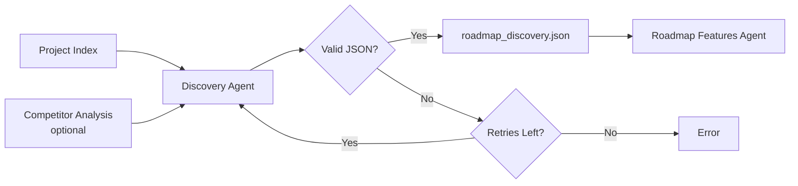

# Roadmap Discovery Agent

## Overview

The **Roadmap Discovery Agent** performs autonomous project analysis to understand purpose, target audience, competitive landscape, and strategic positioning. It lays the foundation for data-driven roadmap generation by creating a comprehensive project profile.

## Role & Purpose

- **Primary Role**: Strategic project understanding and discovery
- **Session Type**: Initial/prerequisite (before roadmap generation)
- **Output**: Structured project discovery JSON with inferred insights
- **Scope**: Analysis and discovery ONLY - NO feature generation
- **Execution Mode**: Non-interactive (cannot ask questions)
- **Skills**: project-discovery

## Core Capabilities

### 1. Autonomous Project Analysis
- Deep exploration of README, documentation, and code
- Inference from available information (NO user questions)
- Technology stack identification
- Maturity level assessment
- Pattern recognition from project structure

### 2. Target Audience Discovery
- Primary and secondary persona identification
- User pain points from documentation analysis
- Goal and usage context inference
- Value proposition extraction

### 3. Product Vision Extraction
- One-liner vision from taglines/headers
- Problem statement synthesis
- Value proposition articulation
- Success metrics identification

### 4. Current State Assessment
- Maturity level determination (idea → mature)
- Existing features from code analysis
- Known gaps from TODO/FIXME comments
- Technical debt identification

### 5. Competitive Context Inference
- Alternative solutions identification
- Differentiator discovery
- Market positioning analysis
- Competitor pain points integration (if available)

### 6. Constraint Identification
- Technical constraints from dependencies
- Resource constraints from git contributors
- External dependencies (APIs, services)
- Platform limitations

## Input Requirements

### Required Files

| File | Location | Purpose |
|------|----------|---------|
| `project_index.json` | Output directory | Project structure cache |
| `README.md` | Project root | Project purpose and features |

### Optional Files

| File | Location | Purpose |
|------|----------|---------|
| `package.json` | Project root | Node.js dependencies and metadata |
| `pyproject.toml` | Project root | Python project configuration |
| `Cargo.toml` | Project root | Rust dependencies |
| `go.mod` | Project root | Go dependencies |
| `competitor_analysis.json` | Output directory | Competitor insights (enhances discovery) |

## Output Specification

### Primary Output

1. **`roadmap_discovery.json`**
   ```json
   {
     "project_name": "string",
     "project_type": "web-app|mobile-app|cli|library|api|desktop-app|other",
     "tech_stack": {
       "primary_language": "string",
       "frameworks": ["string"],
       "key_dependencies": ["string"]
     },
     "target_audience": {
       "primary_persona": "string",
       "secondary_personas": ["string"],
       "pain_points": ["string"],
       "goals": ["string"],
       "usage_context": "string"
     },
     "product_vision": {
       "one_liner": "string",
       "problem_statement": "string",
       "value_proposition": "string",
       "success_metrics": ["string"]
     },
     "current_state": {
       "maturity": "idea|prototype|mvp|growth|mature",
       "existing_features": ["string"],
       "known_gaps": ["string"],
       "technical_debt": ["string"]
     },
     "competitive_context": {
       "alternatives": ["string"],
       "differentiators": ["string"],
       "market_position": "string",
       "competitor_pain_points": ["string"],
       "competitor_analysis_available": boolean
     },
     "constraints": {
       "technical": ["string"],
       "resources": ["string"],
       "dependencies": ["string"]
     },
     "created_at": "ISO8601 timestamp"
   }
   ```

## Workflow Phases

The discovery agent executes 7 sequential phases autonomously:

### PHASE 0: Load Project Context
- Read `project_index.json` for structure
- Check for README, docs, roadmap files
- Identify package manager files
- Check for `competitor_analysis.json` (optional)

### PHASE 1: Understand Project Purpose
- Determine project type (web-app, CLI, library, etc.)
- Extract target users from README and docs
- Identify problem being solved
- Infer value proposition

### PHASE 2: Discover Target Audience
- Define primary persona
- Identify secondary user types
- Extract pain points from documentation
- Determine goals and usage contexts

### PHASE 3: Assess Current State
- Count files and analyze code volume
- Check for tests and CI/CD
- Review git history for activity
- Parse TODO/FIXME for gaps
- Determine maturity level

### PHASE 4: Infer Competitive Context
- Identify alternatives (if mentioned in docs)
- Extract differentiators from README
- Incorporate competitor analysis data (if available)
- Determine market positioning

### PHASE 5: Identify Constraints
- Technical: Dependencies, platform limits
- Resources: Team size from git contributors
- Dependencies: External services/APIs

### PHASE 6: Create Discovery JSON
- Synthesize all findings
- Validate required fields
- Write `roadmap_discovery.json`
- Verify file creation

## Validation Rules

The output must pass these checks:

1. ✅ Valid JSON syntax (no trailing commas)
2. ✅ Contains `project_name` (required)
3. ✅ Contains `target_audience.primary_persona` (required)
4. ✅ Contains `product_vision.one_liner` (required)
5. ✅ All fields use educated inferences (no empty guesses)

## Critical Constraints

### NON-INTERACTIVE Execution
```yaml
mode: autonomous
user_interaction: prohibited
questions: not_allowed
inference_required: true
```

**The agent MUST:**
- Make educated inferences from available data
- Use domain knowledge to fill gaps
- Never ask questions or wait for input
- Complete analysis within MAX_RETRIES attempts

### Inference Guidelines

When information is unclear:
- **Project Type**: Infer from file structure and dependencies
- **Target Audience**: Extract from README headers and descriptions
- **Pain Points**: Identify from problem statements in docs
- **Maturity**: Calculate from code volume, tests, and git activity
- **Constraints**: Derive from package files and architecture

## Integration Points

### Input from Upstream
- `project_index.json` (from project analysis phase)
- `competitor_analysis.json` (optional, from competitor analysis agent)

### Output to Downstream
- `roadmap_discovery.json` → **Roadmap Features Agent**
- Used by: Feature generation, prioritization, phase planning

## Error Handling

### Retry Strategy
- **MAX_RETRIES**: 3 attempts
- **Validation**: JSON syntax and required fields
- **Recovery**: Re-read context and regenerate

### Graceful Degradation
- Missing README: Infer from code structure
- No git history: Assume early stage
- Missing docs: Use code patterns
- All inferences documented in output

## Usage Example

```bash
# Triggered before roadmap generation
roadmap_orchestrator.py --project /path/to/project

# Agent executes:
# 1. Loads project_index.json
# 2. Analyzes README, package files, code
# 3. Infers audience, vision, constraints
# 4. Creates roadmap_discovery.json
# 5. Validates output
# 6. Returns success/failure
```

## Success Criteria

- ✅ `roadmap_discovery.json` created
- ✅ All required fields present
- ✅ Valid JSON structure
- ✅ Educated inferences (not "Unknown" placeholders)
- ✅ Competitor analysis incorporated (if available)
- ✅ Completed within MAX_RETRIES

## Agent Lifecycle



## Related Agents

- **Upstream**: Project Index Generator, Competitor Analysis Agent (optional)
- **Downstream**: Roadmap Features Agent, Roadmap Phase Planner
- **Parallel**: None (sequential execution required)

## References

- Skill: [project-discovery](../skills/project-discovery/SKILL.md)
- Prompt: [roadmap_discovery.md](../prompts/roadmap_discovery.md)
- Auto-Claude Reference: `apps/backend/prompts/roadmap_discovery.md`
